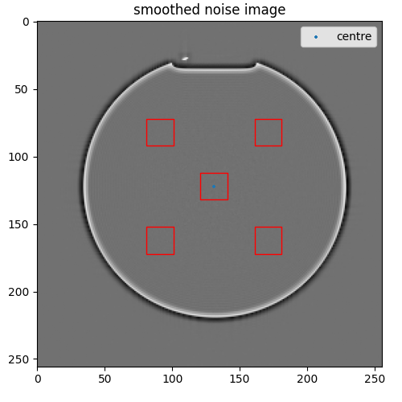

<!-- PROJECT HEADING -->
<br />
<p align="center">

</p>   
<h1 align="center">hazen</h1>
<p align="center">
Quality assurance framework for Magnetic Resonance Imaging
<br />
<a href="https://hazen.readthedocs.io/en/latest/"><strong>Explore the docs »</strong></a>
<br />
<br />
<a href="https://github.com/GSTT-CSC/hazen">View repo</a>
·
<a href="https://github.com/GSTT-CSC/hazen/issues">Report Bug</a>
·
<a href="https://github.com/GSTT-CSC/hazen/issues">Request Feature</a>
</p>
<p align="center">


</p>
<p align="center">Please <b>STAR</b> this repo to receive updates about new versions of hazen!</p>

---

## Overview

hazen is a software framework for performing automated analysis of magnetic resonance imaging (MRI) quality assurance (QA) data.

It provides automatic quantitative analysis for the following measurements of MRI phantom data:
- Signal-to-noise ratio (SNR)
- Spatial resolution
- Slice position and width
- Uniformity
- Ghosting
- MR Relaxometry

Each Task outputs numerical results to the user's terminal. Below is an output from the `hazen snr` Task performed on 
some example MRI data:

```shell
hazen snr tests/data/snr/Siemens
{
  'snr_smoothing_measured_SNR_seFoV250_2meas_slice5mm_tra_repeat_PSN_noDC_2_1': 173.97,
  'snr_smoothing_measured_SNR_seFoV250_2meas_slice5mm_tra_repeat_PSN_noDC_3_1': 177.91,
  'snr_smoothing_normalised_SNR_seFoV250_2meas_slice5mm_tra_repeat_PSN_noDC_2_1': 1698.21,
  'snr_smoothing_normalised_SNR_seFoV250_2meas_slice5mm_tra_repeat_PSN_noDC_3_1': 1736.66,
  'snr_subtraction_measured_SNR_seFoV250_2meas_slice5mm_tra_repeat_PSN_noDC_2_1': 220.73,
  'snr_subtraction_normalised_SNR_seFoV250_2meas_slice5mm_tra_repeat_PSN_noDC_2_1': 2154.69
}
```

The optional `--report` flag allows the user to visualise the image processing performed by each hazen Task:

| `hazen snr tests/data/snr/Siemens --report` | `hazen acr_ghosting tests/data/acr/Siemens --report` |
|---------------------------------------------|------------------------------------------------------|
|  |  |

---

## Installation and usage

### Command line using pip

Hazen can be installed using pip on Python 3.9 or higher, it is recommended to use a virtual environment.
Prerequisits include Python 3.9 version installed, along with `pip` and `venv`

```bash
python3 -m venv hazen-venv
source hazen-venv/bin/activate
pip install hazen

# if hazen is already installed locally, you may upgrade to the latest version
pip install --upgrade pip
pip install --upgrade hazen
```

The CLI version of hazen is designed to be pointed at single folders containing DICOM file(s). Example datasets are provided in the `tests/data/` directory. If you are using the Docker version of hazen (installation described below), replace `hazen` with `hazen-app` in the following commands.

```bash
# To see the full list of available tasks, enter:
hazen -h

# To perform a spatial resolution measurement on example data:
hazen spatial_resolution tests/data/resolution/philips

# To perform an SNR measurement on example Philips DICOMs:
hazen snr tests/data/snr/Philips

# The `--report` option provides additional information about the calculations and is available for all tasks.
# Example usage for the snr function, returns images showing regions used for the measurement.
hazen snr tests/data/snr/Philips --report
```

### Docker

The Docker version of hazen has been made available as it is easy to get up-and-running and is linked to the most recent stable release. Refer to the [Docker installation instructions](https://docs.docker.com/engine/install) to install Docker on your host computer.

The containerised version of Hazen can be obtained from the DockerHub (see commands below). For ease of use, it is recommended to copy the `hazen-app` script to a location accessible on the path such as `/usr/local/bin`. This will allow you to run hazen from any location on your computer. Then, to use Docker hazen, simply run the `hazen-app` script appended with the function you want to use (e.g.: `snr`). 

in Terminal:

```bash
# Once Docker is installed and is running,
# Pull the latest release of the Hazen Docker container
docker pull gsttmriphysics/hazen:latest
# command output will look something like this
latest: Pulling from gsttmriphysics/hazen
Digest: sha256:18603e40b45f3af4bf45f07559a08a7833af92a6efe21cb7306f758e8eeab24a
Status: Image is up to date for gsttmriphysics/hazen:latest
docker.io/gsttmriphysics/hazen:latest

# This will create a folder named 'hazen' in the current working directory
# which can be moved to make it available from anywhere on the terminal
cp hazen/hazen-app /usr/local/bin

# run hazen with CLI arguments, for example
hazen-app snr tests/data/snr/Siemens/
# example command output for the SNR calculation
{   'snr_smoothing_measured_seFoV250_2meas_slice5mm_tra_repeat_PSN_noDC_2_1': 191.16,
    'snr_smoothing_measured_seFoV250_2meas_slice5mm_tra_repeat_PSN_noDC_3_1': 195.58,
    'snr_smoothing_normalised_seFoV250_2meas_slice5mm_tra_repeat_PSN_noDC_2_1': 1866.09,
    'snr_smoothing_normalised_seFoV250_2meas_slice5mm_tra_repeat_PSN_noDC_3_1': 1909.2,
    'snr_subtraction_measured_seFoV250_2meas_slice5mm_tra_repeat_PSN_noDC_2_1': 220.73,
    'snr_subtraction_normalised_seFoV250_2meas_slice5mm_tra_repeat_PSN_noDC_2_1': 2154.69
}
```

### Web Interface

Development of a web interface for hazen is in progress. --> link to hazen web-app? or to the website where it will be hosted

---

## Contributing as a user

Please [raise an Issue](https://github.com/GSTT-CSC/hazen/issues) if you have any problems installing or running hazen. Or if you have suggestions or requests for new features.

We have used hazen with MRI data from a handful of different MRI scanners, including multiple different vendors. If your MRI data doesn't work with hazen, or the results are unexpected, please submit an Issue and we will investigate.

### Contributing as a developer

Please see the CONTRIBUTING.md for developer guidelines.

---
