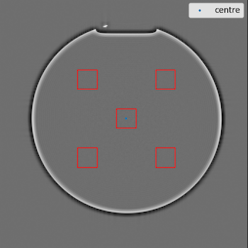
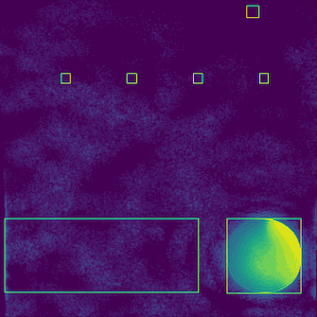

<!-- PROJECT HEADING -->
<br />
<p align="center">
   
</p>   
<h1 align="center">hazen</h1>
<p align="center">
   Quality assurance framework for Magnetic Resonance Imaging
   <br />
   <a href="https://github.com/github_username/repo_name"><strong>Explore the docs »</strong></a>
   <br />
   <br />
   <a href="https://github.com/GSTT-CSC/hazen">View repo</a>
   ·
   <a href="https://github.com/GSTT-CSC/hazen/issues">Report Bug</a>
   ·
   <a href="https://github.com/GSTT-CSC/hazen/issues">Request Feature</a>
</p>
<p align="center">
  
  
</p>
<p align="center">Please <b>STAR</b> this repo to receive updates about new versions of hazen!</p>

---

## Overview

hazen is a software framework for performing automated analysis of magnetic resonance imaging (MRI) Quality Assurance data.

It provides automatic quantitative analysis for the following measurements of MRI phantom data:
- Signal-to-noise ratio (SNR)
- Spatial resolution
- Slice position and width
- Uniformity
- Ghosting
- MR Relaxometry

Some example outputs from hazen:

| hazen snr          | hazen ghosting                  |
| ------------------ | ------------------------------- |
|  |       |

---

## Installation

### Prerequisites

 - Python v3.9
   - conda is required for hazen installation on Mac M1 silicon (arm64 architecture)
 - Git
 - Docker

### Install

First, clone this repo, then follow the instructions for your operating system. To clone:
```bash
git clone git@github.com:GSTT-CSC/hazen.git
```

#### Docker

We recommend using the Docker version of hazen as it is easy to get up-and-running and is linked to the most stable release. Refer to the [Docker installation instructions](https://docs.docker.com/engine/install) to install Docker on your host computer.

For ease of use, it is recommended to copy the `hazen-app` script to a location accessible on the path such as `/usr/local/bin`. This will allow you to run hazen from any location on your computer. Then, to use Docker hazen, simply run the `hazen-app` script appended with the function you want to use (e.g.: `snr`). 

In Terminal:

```bash 
cd hazen
cp ./hazen-app /usr/local/bin

# run hazen
hazen-app snr tests/data/snr/Siemens/

latest: Pulling from gsttmriphysics/hazen
Digest: sha256:18603e40b45f3af4bf45f07559a08a7833af92a6efe21cb7306f758e8eeab24a
Status: Image is up to date for gsttmriphysics/hazen:latest
docker.io/gsttmriphysics/hazen:latest
{   'snr_smoothing_measured_seFoV250_2meas_slice5mm_tra_repeat_PSN_noDC_2_1': 191.16,
    'snr_smoothing_measured_seFoV250_2meas_slice5mm_tra_repeat_PSN_noDC_3_1': 195.58,
    'snr_smoothing_normalised_seFoV250_2meas_slice5mm_tra_repeat_PSN_noDC_2_1': 1866.09,
    'snr_smoothing_normalised_seFoV250_2meas_slice5mm_tra_repeat_PSN_noDC_3_1': 1909.2,
    'snr_subtraction_measured_seFoV250_2meas_slice5mm_tra_repeat_PSN_noDC_2_1': 220.73,
    'snr_subtraction_normalised_seFoV250_2meas_slice5mm_tra_repeat_PSN_noDC_2_1': 2154.69}
```

#### Linux & MacOS

For developers, hazen can be installed using `pip`. We highly recommend using a virtual environment.

```bash
# Go to local hazen repo directory
cd hazen

# Create and activate a virtual environment
python3 -m venv ./hazen-venv
source hazen-venv/bin/activate

# Install requirements
pip install --upgrade pip setuptools wheel
pip install -r requirements.txt

# Install hazen
python setup.py install

# Run tests to ensure everything is working
pytest tests/
```

#### MacOS using M1 processors (Apple silicon arm64 architecture)

For developers using MacOS with M1 processors, installation via `conda` is required. This is because various Python packages have not been updated to install with `pip`. Installation of hazen via conda is a temporary workaround. 

```bash
# Download and install conda (we have tested with both Miniforge and Miniconda):
brew update
brew upgrade
brew install miniforge

# Create and activate virtual environment
conda create --name hazen-venv --file environment.yml
conda activate hazen-venv

# Build hazen
cd hazen
python setup.py install

# Run tests to ensure everything is working
pytest tests/
```

---

## Usage

### Command Line

The CLI version of hazen is designed to be pointed at single folders containing DICOM file(s). Example datasets are provided in the `tests/data/` directory. If you are not using the Docker version of hazen, replace `hazen-app` with `hazen` in the following commands.

To perform an SNR measurement on the provided example Philips DICOMs:

`hazen-app snr tests/data/snr/Philips`

To perform a spatial resolution measurement on example data provided by the East Kent Trust:

`hazen-app spatial_resolution tests/data/resolution/philips`

To see the full list of available tools, enter:

`hazen-app -h`

The `--report` option provides additional information for some of the functions. For example, the user can gain additional insight into the performance of the snr function by entering:

`hazen-app snr tests/data/snr/Philips --report`

### Web Interface

WIP: we are developing a web interface for hazen.

---

## Contributors

If you want to contribute to the development of hazen, please take a look at: `CONTRIBUTING.md`.

---

## Users

Please [raise an Issue](https://github.com/GSTT-CSC/hazen/issues) if you have any problems installing or running hazen.

We have used hazen with MRI data from a handful of different MRI scanners, including multiple different vendors. If your MRI data doesn't work with hazen, or the results are unexpected, please submit an Issue and we will investigate. 


